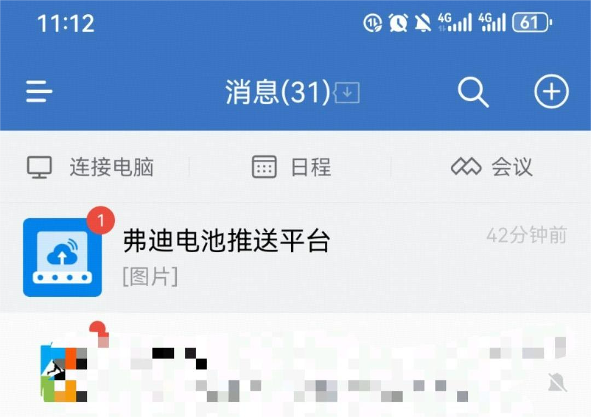
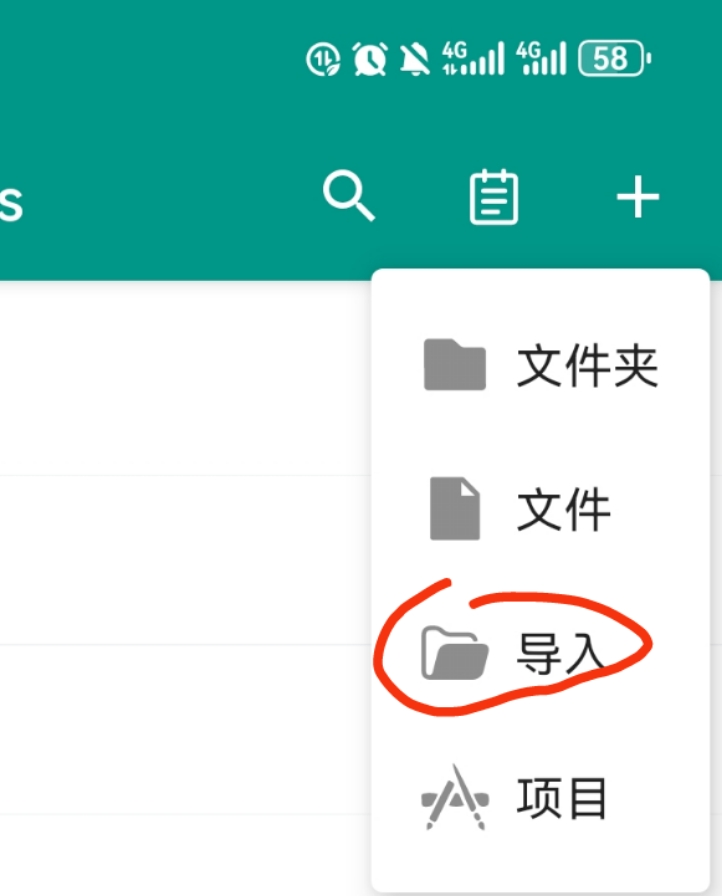
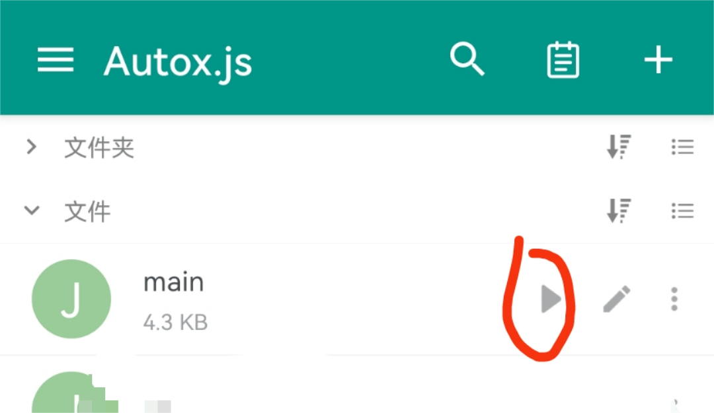

# SafeDaKa
BYD 企业微信 自动安全DAKA （ 软件仅供学习和参考，q群：674088261 ）

## 运行环境及配置

环境：
- 安卓手机
- 企业微信 4.1.7（23550）【最好一样，其它版本没有测试过；自行去官网下载安装】
- AutoJS 6.4.3 【本工程下的文件`org.autojs.autoxjs.v6.apk`】

配置：

1. 需要手动将”弗迪电池推送平台“置顶，如图所示：

2. 打开AutoJS软件，把本工程中的 `main.js` 导入其中，保存（或者新建一个，然后把脚本的内容手动拷贝过来）。如图所示：

## 执行程序

运行前的准备：
1. 关闭企业微信的后台。
2. 打开AutoJS软件的 无障碍服务 （每个手机打开方式不同，自行研究。可以配置快捷按钮，例如在我手机上按住上下音量键快速打开。）

运行，如图所示：

## 后期更新

1. 加入友好界面进行操作。
2. 增加连续补卡功能。

## 打赏

软件的更新和做下去的动力需要你的支持，打赏二维码如下：

